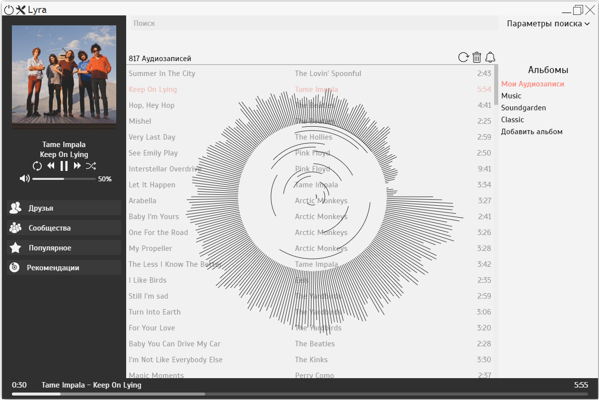

# Lyra v. 0.3.0
Music player with **VK** (russian social network) **API** integration. It has an **audio visualizer**, **playlists** and some other features.
Lyra uses [Electron](http://electron.atom.io/ "Electron website") framework so it's a crossplatform app.

## How to install
You may download  [Electron](https://github.com/atom/electron/releases "Electron download"). Then you download Lyra repository, install `node_modules` with `npm install` and replace everything in `electron/resources/default_app` with Lyra repository.
### Feel free to make a pull request
### License: Apache License Version 2.0 
